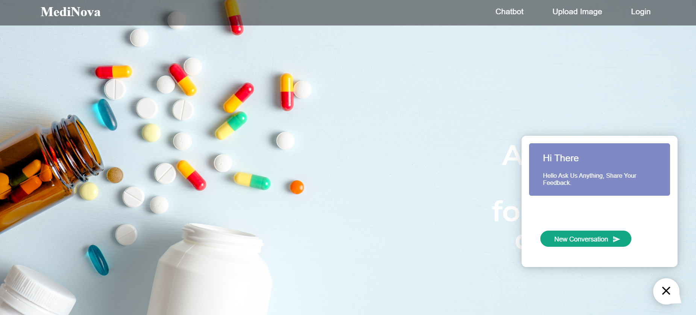
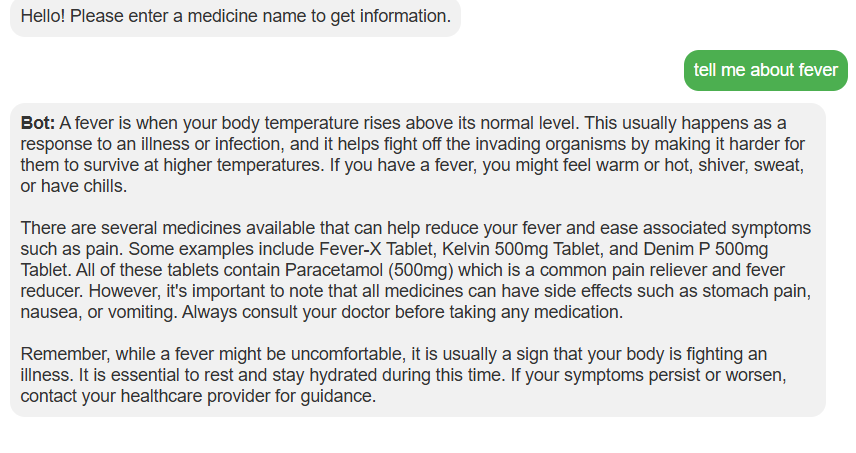
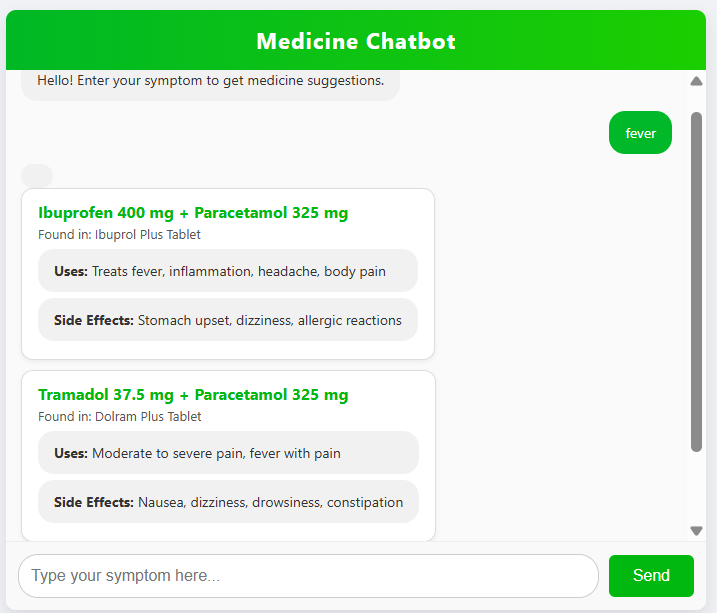
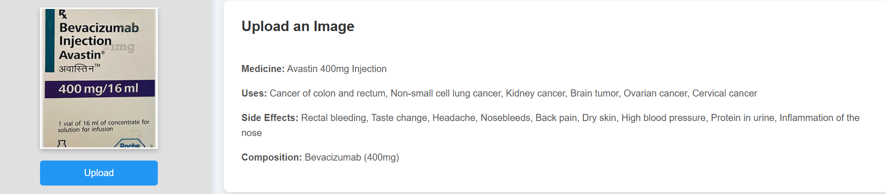
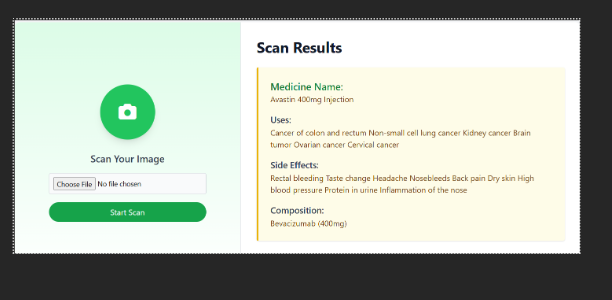

# 🩺 MediNova: Your AI-Powered Medical Companion

**MediNova** is an intelligent healthcare assistant designed to bridge the gap between unstructured medical documents and actionable health insights. By integrating **Optical Character Recognition (OCR)** with a **Retrieval-Augmented Generation (RAG)** pipeline, MediNova transforms prescription images and natural language queries into reliable, context-aware medical information.

---

### 🚀 Key Features

* **✅ OCR Prescription Analysis:** Automatically extracts medicine names and dosages from uploaded handwritten or printed images.
* **✅ RAG-Powered Q&A:** Combines a curated medical knowledge base with LLMs to provide factual, evidence-based answers.
* **✅ Semantic Medicine Search:** Uses **FAISS** for lightning-fast vector searches across extensive drug databases.
* **✅ Interactive Streamlit UI:** A sleek, user-friendly interface designed for both patients and healthcare providers.
* **✅ Secure Access:** Integrated basic authentication to ensure user data privacy.

---

### 🛠️ The Tech Stack

| Layer | Technologies |
| :--- | :--- |
| **Frontend** | Streamlit, HTML5/CSS3, Lottie Animations |
| **Orchestration** | Python, LangChain (RAG Pipeline) |
| **AI/NLP** | Hugging Face Transformers, Sentence Transformers |
| **OCR Engine** | Tesseract OCR |
| **Vector DB** | FAISS (Facebook AI Similarity Search) |
| **Data Handling** | Pandas, NumPy, Pickle |

---

### 📖 System Architecture

MediNova operates on a multi-stage pipeline to ensure accuracy:
1.  **Ingestion:** User uploads an image or types a query.
2.  **Processing:** OCR extracts text; NLP models generate semantic embeddings.
3.  **Retrieval:** The system queries the **FAISS index** to find the most relevant medical context.
4.  **Generation:** An LLM synthesizes the retrieved data into a natural, easy-to-understand response.


---

### 🔧 Installation & Setup

#### 1. Clone & Environment
```bash
# Clone the repository
git clone https://github.com/your-username/medinova.git
cd medinova

# Create a virtual environment
python -m venv rag-env

# Activate (Windows)
rag-env\Scripts\activate
# Activate (Mac/Linux)
source rag-env/bin/activate
```

#### 2. Install Dependencies
```bash
pip install -r requirements.txt
```

#### 3. Configuration
Create a `.env` file in the root directory and add your specific configurations:
```env
API_KEY=your_key_here
TESSERACT_PATH=C:\Program Files\Tesseract-OCR\tesseract.exe
```

#### 4. Launch
```bash
streamlit run app.py
```

---

interface
🎥 Demo

👉 Demo Video:
[Watch Demo Video](assets/UploadImage.gif)

🖥️ Interface Preview
<p align="center">  </p>

MediNova provides a simple and user-friendly interface where users can either upload prescription images or ask medicine-related questions. When a medicine image is uploaded or a drug name is queried, the system returns detailed information such as symptoms, uses, composition, manufacturer details, and other relevant drug insights in a structured format.

Additionally, the system also works in reverse mode—when users input symptoms, it suggests possible medicines and related treatments based on the medical dataset and AI-driven retrieval system. This dual capability makes the assistant more practical and useful for real-world healthcare guidance. The system is designed to minimize complexity while maximizing usability, ensuring that even non-technical users can interact easily and get meaningful medical assistance.


<p align="center">  </p>

The prescription upload module allows users to submit medical images, which are processed using OCR technology. The extracted text is cleaned, structured, and passed into the NLP pipeline for further analysis, enabling accurate extraction of medicine names and related information.

<p align="center">  </p>

The AI-powered Q&A system enables users to ask health-related questions in natural language. Using a Retrieval-Augmented Generation pipeline, the system fetches relevant medical context and generates intelligent, context-aware responses, improving reliability and accuracy.

<p align="center">  </p>

The medicine search system is powered by FAISS, enabling fast semantic search across medical datasets. This ensures quick retrieval of relevant drug information, enhancing response speed and system efficiency.

<p align="center">  </p>

Overall, MediNova delivers an end-to-end AI healthcare assistant experience by combining OCR, NLP, and RAG technologies into a unified system that is efficient, scalable, and user-friendly.
---

### 📬 Contact & Support

**Developer:** Pragna Padamata  
**Email:** [pragnasrilalithapadamata@gmail.com](mailto:pragnasrilalithapadamata@gmail.com)  

---
### 📜 License
This project is licensed under the **MIT License**. Feel free to use, modify, and distribute!
